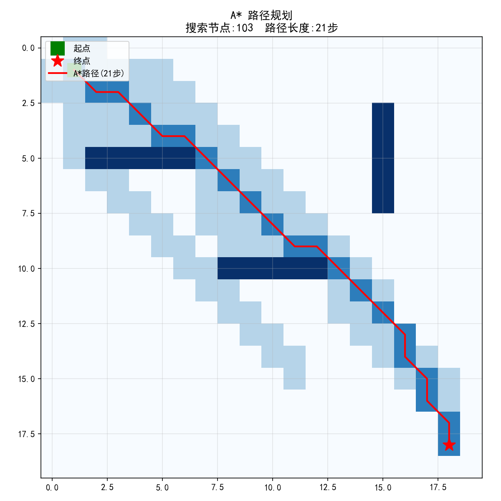
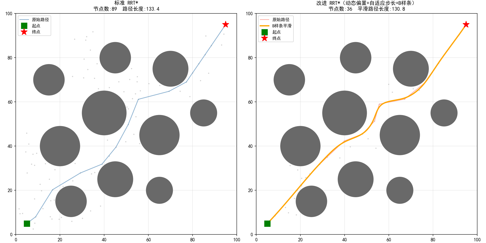

# Robot Control Algorithms

机器人关节控制算法实现，涵盖经典控制（PID/MPC）与路径规划（A*）。

## 项目结构
robot-control-algorithms/
├── pid.m                    # PID仿真（MATLAB）
├── mpc/
│   ├── mpc_joint.py         # MPC基础控制
│   ├── mpc_constraint.py    # MPC硬约束演示
│   └── compare.py           # PID vs MPC对比
└── trajectory/
└── astar.py             # A*路径规划
## 1. PID 关节位置控制（MATLAB）

对机械臂单关节进行位置控制，系统建模为二阶质量-阻尼系统（M=1kg，B=2 N·m·s/rad）。

**实现内容：** 位置式PID、积分抗饱和（clamping）、微分低通滤波

**调参实验：**

| 参数组 | Kp | Ki | Kd | 现象 |
|--------|----|----|-----|------|
| 欠阻尼 | 50 | 10 | 1  | 响应慢，3秒未收敛 |
| 中等   | 50 | 10 | 5  | 超调约20%，1.2秒收敛 |
| 较优   | 50 | 10 | 20 | 超调约15%，响应平滑 |
| 纯PD   | 50 | 0  | 20 | 存在稳态误差，验证积分项必要性 |

**运行：** MATLAB打开`pid.m`，F5运行。

---

## 2. MPC 关节位置控制（Python/casadi）

基于casadi/ipopt实现线性MPC，状态x=[位置,速度]，预测时域N=20步。

**核心优势：** 天然支持硬约束，力矩消耗比PID低78%（23 vs 100 N·m）

### PID vs MPC 对比


| 指标 | PID | MPC |
|------|-----|-----|
| 到达时间 | ~1.0s | ~0.5s |
| 最大力矩 | 100N·m（限幅） | 23N·m |
| 超调 | ~15% | ~5% |
| 硬约束支持 | ✗ | ✓ |

### 硬约束演示
目标位置2.0rad，关节限位1.5rad，MPC自动停在限位边界。

**运行：**
```bash
pip install casadi matplotlib numpy
python mpc/compare.py          # PID vs MPC对比
python mpc/mpc_constraint.py   # 硬约束演示
```

---

## 3. A* 路径规划（Python）

20×20栅格地图，8方向移动，欧几里得启发函数。



| 指标 | 结果 |
|------|------|
| 地图大小 | 20×20 |
| 搜索节点 | 103 / 400 |
| 路径长度 | 21步 |

**运行：**
```bash
python trajectory/astar.py
```
---

## 4. 改进 RRT* 路径规划（Python）

在标准 RRT* 基础上实现两项改进，并加入 B 样条路径平滑。

### 改进点

**① 动态目标偏置概率**
初期偏置概率高（P₀=0.6），让树快速朝目标生长；随迭代次数线性衰减至 Pmin=0.1，后期增加随机性避免局部最优。

**② 自适应步长**
碰撞时步长缩小（×0.8），畅通时步长扩大（×1.2），在障碍密集区提高精度，在空旷区提高速度。

**③ B 样条路径平滑**
对原始折线路径进行三次 B 样条拟合，生成曲率连续的平滑轨迹，含碰撞检测防止平滑后穿障。

### 对比结果



| 指标 | 标准 RRT* | 改进 RRT* |
|------|-----------|-----------|
| 节点数 | 89 | 36（↓ 60%）|
| 路径长度 | 133.4 | 130.8（↓ 2%）|
| 路径平滑 | 折线 | B样条曲线 |

### 运行方法
```bash
python trajectory/improved_rrt_star.py
```
