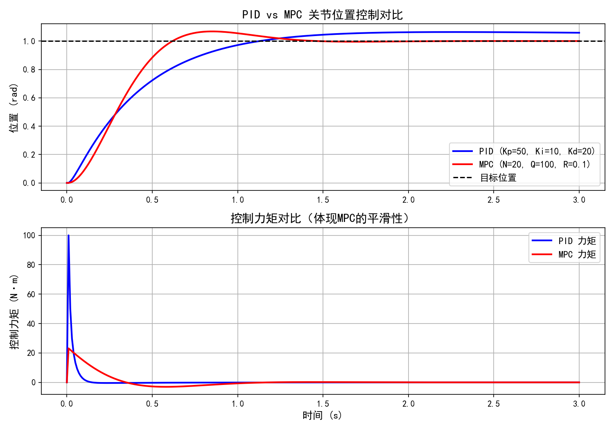

# Robot Control Algorithms

机器人关节控制算法实现，包含 PID 和 MPC 控制器仿真。

## PID 关节位置控制

### 问题描述
对机械臂单关节进行位置控制，系统建模为二阶质量-阻尼系统（M=1kg，B=2 N·m·s/rad），目标位置 1.0 rad。

### 实现内容
- 位置式PID控制器（含积分限幅、输出限幅）
- 积分抗饱和（clamping方法）
- 微分低通滤波

### 调参实验结果

| 参数组 | Kp | Ki | Kd | 现象 |
|--------|----|----|-----|------|
| 欠阻尼 | 50 | 10 | 1  | 响应慢，3秒未收敛 |
| 中等   | 50 | 10 | 5  | 超调约20%，1.2秒收敛 |
| 较优   | 50 | 10 | 20 | 超调约15%，响应平滑 |
| 纯PD   | 50 | 0  | 20 | 存在稳态误差，验证积分项必要性 |

### 运行方法
MATLAB 打开 `pid.m`，直接运行（F5）。

## MPC 关节位置控制


### 方法
基于 casadi/ipopt 实现线性MPC，状态空间模型 x=[位置,速度]，预测时域N=20步。

### 参数
- 预测时域 N=20，状态权重 Q=diag(100,1)，控制权重 R=0.1
- 约束：力矩 ±100N·m，关节角度 ±180°

### PID vs MPC 对比结果



| 指标 | PID | MPC |
|------|-----|-----|
| 到达时间 | ~1.0s | ~0.5s |
| 最大力矩 | 100N·m（限幅） | 23N·m |
| 超调 | ~15% | ~5% |
| 稳态误差 | 无 | 无 |

### 运行方法
```bash
pip install casadi matplotlib numpy
python mpc/compare.py
```
